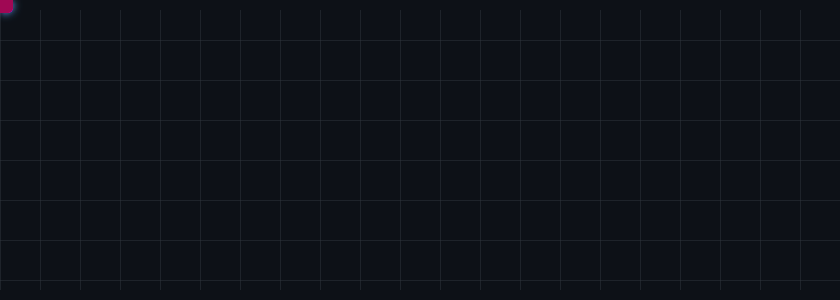

---

## 🐍 网格贪吃蛇

**一条霓虹蛇在方格世界里自主巡游，追猎前方的红色方块 —— 无限循环。**

*GitHub 主页禁止运行脚本，上面是预录的巡游动画；点按钮进入互动版——整页网格，蛇沿方格追你的鼠标。*

---

## 🛠 作品

<table><tr><td align="center" width="420">

### 🛡 [bounty-guard](https://github.com/Croesus-K/bounty-guard)

**AI 代码安全审查助手**：规则引擎初筛 + LLM 复核，守住每一行 diff。GitHub Action 一行接入，无 API Key 自动降级为纯规则模式。

</td><td align="center" width="420">

### 🎯 [bounty-guard-playground](https://github.com/Croesus-K/bounty-guard-playground)

**实战靶场仓库**：故意埋了 3 个安全问题的演示 PR，验证扫描器的粘性评论与门禁行为。

</td></tr></table>

---

## 📦 全部项目

**原创**

- 🧠 [**InjectArena**](https://github.com/Croesus-K/InjectArena) —— 攻心 · 中文可自部署的 **LLM 提示注入攻防闯关靶场**，攻防双向评分 
- 🗡 [**Dark Bounty Killer**](https://github.com/Croesus-K/Dark-Bounty-Killer-Mission-Contract-Management-System) —— 纯前端沉浸式暗黑赏金猎人风格**任务管理工具**：杀手契约 / 悬赏任务、全生命周期管理、智能到期排序、实时倒计时，数据可导出 JSON，开箱即用 
- 🛡 [**bounty-guard**](https://github.com/Croesus-K/bounty-guard) —— AI 代码安全审查助手（详见上方卡片） 
- 🎯 [**bounty-guard-playground**](https://github.com/Croesus-K/bounty-guard-playground) —— 扫描器实战靶场（详见上方卡片） 

**Fork 参与**

- 🌐 [owasp-vwad.github.io](https://github.com/Croesus-K/owasp-vwad.github.io) —— OWASP VWAD 官网（InjectArena 收录 PR 审核中）
- 🌐 [www-project-vulnerable-web-applications-directory](https://github.com/Croesus-K/www-project-vulnerable-web-applications-directory) —— OWASP VWAD：知名脆弱应用登记册

---

## ✍️ 正在写

> 📖 **《我给自己造了个 AI 代码安全审查器》**
> 从 `Math.random` 弱随机的教训，到 98 项测试、误报率实测的完整故事。

---

## 🔥 战绩

---

<!-- 动态 stat 卡片待 npm 发布后一并添加 -->

